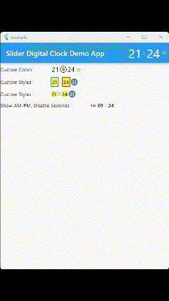

# Slide Digital Clock Plugin


## Usage
To use plugin, just import package `import 'package:slide_digital_clock/slide_digital_clock.dart';`

## Defaults

    is24HourTimeFormat : `true`
    showSecondsDigit : `true`
    areaWidth : `180.0`
    areaDecoration : `BoxDecoration(
                border: Border.all(color: Colors.transparent),
                borderRadius: BorderRadius.circular(20),
                color: Color.fromARGB(255, 3, 12, 84)
                )`
    areaAligment : `AlignmentDirectional.bottomCenter`
    hourMinuteDigitDecoration : `BoxDecoration(
                      border: Border.all(color: Colors.white),
                      borderRadius: BorderRadius.circular(5)
                      )`
    secondDigitDecoration : `BoxDecoration(
                      border: Border.all(color: Colors.white),
                      borderRadius: BorderRadius.circular(5)
                      )`
    digitAnimationStyle : `Curves.decelerate`
    hourMinuteDigitTextStyle : `TextStyle(color: Colors.white, fontSize: 30))`
    secondDigitTextStyle : `TextStyle(color: Colors.white, fontSize: 15))`
    amPmDigitTextStyle : `TextStyle(color: Colors.white, fontSize: 15))`

## Demo


## Example 

```
import 'package:flutter/material.dart';
import 'package:slide_digital_clock/slide_digital_clock.dart';

void main() => runApp(MyApp());

class MyApp extends StatelessWidget {
  @override
  Widget build(BuildContext context) {
    var _textStyle = TextStyle(
      color: Colors.red,
      fontSize: 50,
    );
    return MaterialApp(
        debugShowCheckedModeBanner: false,
        title: 'Slider Digital Clock Demo',
        home: Scaffold(
          appBar: AppBar(
            title: Text("Slider Digital Clock Demo"),
            actions: <Widget>[
              DigitalClock(
                areaDecoration: BoxDecoration(color: Colors.transparent),
                areaAligment: AlignmentDirectional.center,
                hourMinuteDigitDecoration:
                    BoxDecoration(color: Colors.transparent),
                hourMinuteDigitTextStyle: TextStyle(fontSize: 15),
                secondDigitTextStyle: TextStyle(fontSize: 11),
              )
            ],
          ),
          body: Center(
            child: Column(
              crossAxisAlignment: CrossAxisAlignment.center,
              mainAxisAlignment: MainAxisAlignment.center,
              children: <Widget>[
                DigitalClock(),
                SizedBox(
                  height: 20,
                ),
                DigitalClock(
                  is24HourTimeFormat: false,
                  digitAnimationStyle: Curves.bounceInOut,
                ),
                SizedBox(
                  height: 20,
                ),
                DigitalClock(
                  digitAnimationStyle: Curves.elasticOut,
                  is24HourTimeFormat: false,
                  areaDecoration: BoxDecoration(
                    color: Colors.transparent,
                  ),
                  hourMinuteDigitTextStyle: TextStyle(
                    color: Colors.blueGrey,
                    fontSize: 50,
                  ),
                  amPmDigitTextStyle: TextStyle(color: Colors.blueGrey, fontWeight: FontWeight.bold),              
                ),
                SizedBox(
                  height: 20,
                ),
                DigitalClock(
                  digitAnimationStyle: Curves.easeOutExpo,
                  hourMinuteDigitTextStyle: TextStyle(
                    color: Colors.yellow,
                    fontSize: 50,
                  ),
                ),
                SizedBox(
                  height: 20,
                ),
                DigitalClock(
                  hourMinuteDigitTextStyle: TextStyle(
                    color: Colors.yellow,
                    fontSize: 50,
                  ),
                  secondDigitTextStyle: TextStyle(
                    color: Colors.white,
                    fontSize: 50,
                  ),
                ),
                SizedBox(
                  height: 20,
                ),
                DigitalClock(
                  areaWidth: 180,
                  showSecondsDigit: false,
                  hourMinuteDigitTextStyle: TextStyle(
                    color: Colors.yellow,
                    fontSize: 50,
                  ),
                ),
              ],
            ),
          ),
        ));
  }
}

```