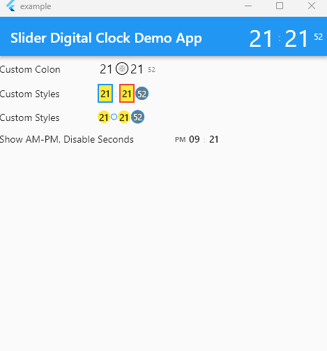

# Slide Digital Clock Plugin

## Usage

To use plugin, just import package `import 'package:slide_digital_clock/slide_digital_clock.dart';`

## Defaults

    is24HourTimeFormat : `true`
    showSecondsDigit : `true`    a
    areaAligment : `AlignmentDirectional.bottomCenter`   
    digitAnimationStyle : `Curves.decelerate`
    hourMinuteDigitTextStyle : `Theme.of(context).textTheme.bodyText1`
    secondDigitTextStyle : `Theme.of(context).textTheme.caption!.copyWith(fontSize: 10))`
    amPmDigitTextStyle : `Theme.of(context).textTheme.caption!.copyWith(fontSize: 10, fontWeight: FontWeight.bold)`

## Demo


## Pics



## Example

```
import 'package:flutter/material.dart';
import 'package:slide_digital_clock/slide_digital_clock.dart';

void main() {
  runApp(const ExampleApp());
}

class ExampleApp extends StatelessWidget {
  const ExampleApp({super.key});

  @override
  Widget build(BuildContext context) {
    return MaterialApp(
      debugShowCheckedModeBanner: false,
      title: "Slider Digital Clock Demo App",
      home: Scaffold(
        appBar: AppBar(
            title: const Text("Slider Digital Clock Demo App"),
            actions: [
              DigitalClock(
                hourMinuteDigitTextStyle: Theme.of(context)
                    .textTheme
                    .headline4!
                    .copyWith(color: Colors.white),
                secondDigitTextStyle: Theme.of(context)
                    .textTheme
                    .caption!
                    .copyWith(color: Colors.white),
                colon: Text(
                  ":",
                  style: Theme.of(context)
                      .textTheme
                      .subtitle1!
                      .copyWith(color: Colors.white),
                ),
              )
            ]),
        body: Column(
          children: [
            Row(
              mainAxisAlignment: MainAxisAlignment.start,
              children: [
                const Text("Custom Colon"),
                const SizedBox(width: 50),
                DigitalClock(
                  hourMinuteDigitTextStyle: const TextStyle(fontSize: 18),
                  colon: const Icon(Icons.ac_unit, size: 12),
                  colonDecoration: BoxDecoration(
                      border: Border.all(), shape: BoxShape.circle),
                )
              ],
            ),
            Row(
              mainAxisAlignment: MainAxisAlignment.start,
              children: [
                const Text("Custom Styles"),
                const SizedBox(width: 50),
                DigitalClock(
                  hourDigitDecoration: BoxDecoration(
                      color: Colors.yellow,
                      border: Border.all(color: Colors.blue, width: 2)),
                  minuteDigitDecoration: BoxDecoration(
                      color: Colors.yellow,
                      border: Border.all(color: Colors.red, width: 2)),
                  secondDigitDecoration: BoxDecoration(
                      color: Colors.blueGrey,
                      border: Border.all(color: Colors.blue),
                      shape: BoxShape.circle),
                  secondDigitTextStyle: Theme.of(context)
                      .textTheme
                      .caption!
                      .copyWith(color: Colors.white),
                ),
              ],
            ),
            Row(
              mainAxisAlignment: MainAxisAlignment.start,
              children: [
                const Text("Show AM-PM, Disable Seconds"),
                const SizedBox(width: 50),
                DigitalClock(
                  is24HourTimeFormat: false,
                  showSecondsDigit: false,
                ),
              ],
            )
          ],
        ),
      ),
    );
  }
}


```
